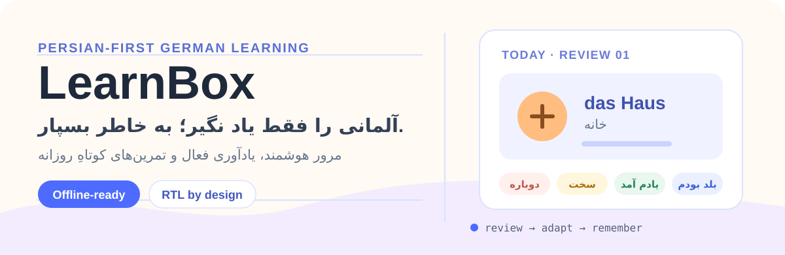
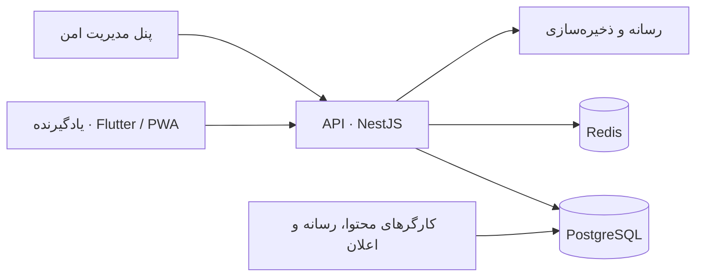

<p align="center">
  
</p>

<p align="center">
  <a href="https://github.com/bahramghorbani/learnbox/actions/workflows/quality.yml"></a>
  
  
</p>

<p align="center"><strong>یک پلتفرم فارسی‌محور و مقاوم در برابر قطعی اینترنت برای به‌خاطر سپردن واژگان آلمانی.</strong></p>

## LearnBox چیست؟

LearnBox به فارسی‌زبان‌ها کمک می‌کند واژگان کاربردی آلمانی را با یادآوری فعال، مرور فاصله‌دارِ تطبیقی، تصویر، مثال و تمرین‌های کوتاه روزانه به خاطر بسپارند. اولویت نسخهٔ اولیه، واژگان A1 و A2 برای مهاجرت کاری، تحصیلی و زندگی روزمره است.

### چرا متفاوت است؟

- **یادگیری بر پایهٔ حافظه:** پاسخ فعال و زمان‌بندی مرور؛ نه صرفاً نمایش فلش‌کارت.
- **آرام و انسانی:** بازگشت پس از وقفه با حالت بازیابی، بدون فشار یا سرزنش.
- **فارسی از ابتدا:** رابط RTL، تایپوگرافی خوانا و جداسازی درست محتوای آلمانی.
- **آفلاین‌محور:** صف رویدادهای مرور و داده‌های ضروری روی دستگاه نگهداری و بعداً همگام می‌شوند.
- **هوش مصنوعیِ کنترل‌شده:** AI برای پیشنهاد و QA محتواست، نه وابستگی هر لحظهٔ جلسهٔ یادگیری.

## مسیر یادگیری

```text
امروز → کارتِ تصویری و مثال → پاسخ فعال → زمان‌بندی تطبیقی → پیشرفتِ قابل‌فهم
```

هستهٔ زمان‌بندی اولیه در [`packages/learning-engine`](./packages/learning-engine) قرار دارد و از ابتدا به‌گونه‌ای طراحی شده که با داده‌های واقعی یادگیری قابل تکامل باشد.

## وضعیت فعلی

| بخش     | آماده است                                                                |
| ------- | ------------------------------------------------------------------------ |
| معماری  | مونوریپو، API، وب عمومی، پنل مدیریت و پوستهٔ Flutter                     |
| یادگیری | مدل درجه‌بندی و موتور زمان‌بندی اولیه با تست واحد                        |
| داده    | مهاجرت ابتدایی PostgreSQL و طراحی همگام‌سازی idempotent                  |
| کیفیت   | قالب‌بندی، lint، type check، تست، build، اسکن وابستگی و اسکن رازها در CI |
| محصول   | سند مرجع، ADR، استوری‌بورد ۳۰ مرحله‌ای، ریسک و امنیت                     |

جزئیات پیشرفت را در [استوری‌بورد](./docs/storyboard/MASTER_PROJECT_STORYBOARD.md) و وضعیت لحظه‌ای را در [`STATUS.md`](./docs/storyboard/STATUS.md) ببینید.

## شروع محلی

### پیش‌نیازها

- Node.js 22 یا جدیدتر
- pnpm 10 یا جدیدتر
- Docker Desktop
- Flutter stable برای اجرای اپ موبایل

### اجرای نخستین نسخهٔ توسعه

```bash
cp .env.example .env
docker compose up -d
pnpm install
pnpm check
pnpm dev
```

برای اجرای تحلیل و تست موبایل:

```bash
cd apps/mobile
flutter pub get
flutter analyze
flutter test
```

راهنمای عملیاتی کامل در [`docs/operations/RUNBOOK.md`](./docs/operations/RUNBOOK.md) است. هیچ رمز، کلید یا OTP واقعی را در فایل‌ها یا گزارش‌ها وارد نکنید.

## نقشهٔ فنی



- **موبایل و PWA:** Flutter، رابط RTL و دادهٔ محلی برای مرور آفلاین.
- **وب و مدیریت:** Next.js برای صفحات SEO و پنل امن.
- **بک‌اند:** NestJS، PostgreSQL، Redis، مهاجرت‌ها و OpenAPI.
- **یکپارچه‌سازی‌ها:** SMS، پرداخت، AI، اعلان و ذخیره‌سازی همگی پشت مرزهای قابل‌تعویض می‌مانند.

## مستندات کلیدی

- [سند اجرایی اصلی](./docs/product/MASTER_SPEC.md)
- [معماری سیستم](./ARCHITECTURE.md)
- [مدل یادگیری](./docs/learning/LEARNING_MODEL.md)
- [راهبرد آفلاین و همگام‌سازی](./docs/architecture/OFFLINE_SYNC.md)
- [امنیت و حریم خصوصی](./SECURITY.md)
- [نقشهٔ راه](./ROADMAP.md)
- [راهنمای مشارکت](./CONTRIBUTING.md)

## محدودهٔ فعلی

این ریپازیتوری در مرحلهٔ فونداسیون است. ورود با پیامک واقعی، محتوای منتشرشده، Bobo نهایی، پرداخت، زیرساخت تولید و انتشار عمومی هنوز فعال نشده‌اند. این مرزها عمداً قبل از تأیید مالک، قرارداد/اعتبارسنجی لازم و تست‌های مناسب فعال نخواهند شد.

## کیفیت و اصول مشارکت

پیش از هر تغییر، معیارهای پذیرش، RTL، دسترس‌پذیری، وضعیت آفلاین، حریم خصوصی، تحلیل رویدادها و امکان بازگشت بررسی می‌شوند. برای اجرای کنترل‌های پایه:

```bash
pnpm check
pnpm build
node scripts/validate-migrations.mjs
```

جزئیات در [`AGENTS.md`](./AGENTS.md) و [راهبرد تست](./docs/product/MASTER_SPEC.md#28-testing-strategy) ثبت شده است.
