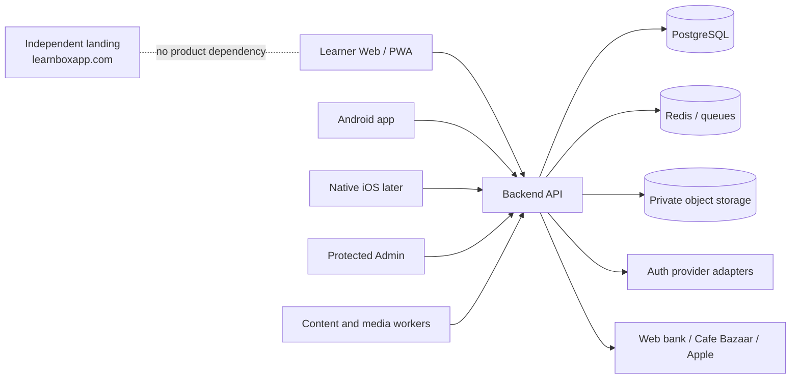

# LearnBox system context



## Product boundaries

- The landing site is a standalone informational product and must not import learner, admin or API code.
- Learner Web is the immediate online user surface and interim iOS route.
- Android and future iOS clients use the same account, content and entitlement contracts.
- Admin is a protected operational surface, not a learner-facing route.
- API owns account identity, canonical vocabulary, pack membership, progress reconciliation, purchases and entitlements.

## Online-first and offline-tolerant behavior

The server is authoritative for account, canonical content, entitlement and reconciled learning state. Clients may retain a bounded local cache and durable pending review events during temporary disconnects. Reconnect uses learner-scoped, idempotent client event IDs and returns the authoritative reconciled state.

```text
normal: client ↔ API
brief disconnect: local cache + pending queue
reconnect: pending events → authenticated API → acknowledgement + authoritative state
```

## Content factory

Admin requests create jobs. Workers generate in batches, validate, detect duplicates, produce or attach media, and return a review queue. AI cannot publish directly. A canonical vocabulary item is reusable across packs; a user's review state is separate from pack membership.

## Commerce

Provider-specific adapters verify transactions server-side. Web, Cafe Bazaar and Apple offers may differ in price and product ID, but all successful verification maps to a shared pack entitlement.

## Security boundary

Secrets remain server-side. Native auth must use a non-SSO gateway when activated; Vercel Browser SSO is not a native API transport. Production, provider, payment, release and destructive actions require explicit owner-approved gates.
