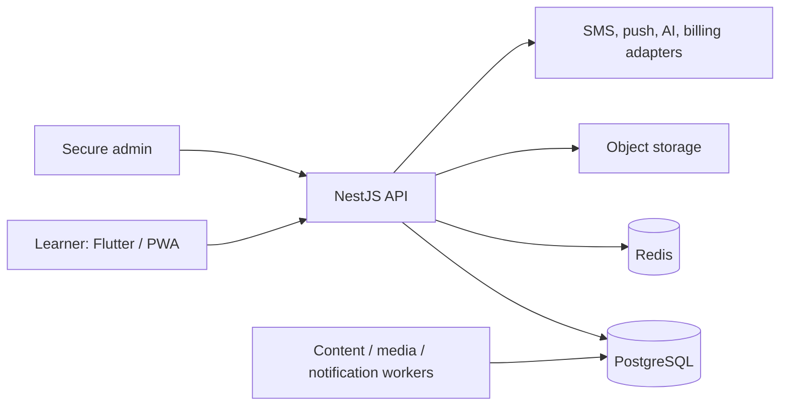

# System context

```mermaid
flowchart LR
  Learner["Learner: Flutter / PWA"] --> API["NestJS API"]
  Admin["Secure admin"] --> API
  API --> PG[(PostgreSQL)]
  API --> Redis[(Redis)]
  API --> Store["Object storage"]
  API --> Providers["SMS, push, AI, billing adapters"]
  Worker["Content / media / notification workers"] --> PG
```

All provider integrations are replaceable. The mobile client stores due cards and unsynced events locally; the API reconciles idempotently.
