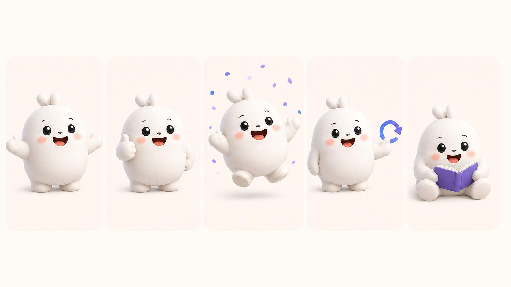

# Bobo canonical visual reference

این برگه، مرجع رسمی بوبوی LearnBox در نسخهٔ `1.0.0` است. تنها همین شخصیت سفید، پشمالو و یک‌تکه برای محصول استفاده می‌شود: بدون گردن، با دو گوش کوتاهِ چسبیده کنار هم. هیچ نسخهٔ خرگوشی یا بازتفسیرشده‌ای مجاز نیست.

ترتیب حالت‌ها از چپ به راست: `welcome`، `encourage`، `celebrate`، `recovery` و `focus`.

## فایل‌های قابل استفاده در محصول

پنج فایل زیر نسخه‌های شفافِ تأییدشده‌اند. هر کدام با مرجع رسمی `1.0.0` ساخته، از نظر ظاهر بررسی و به‌صورت PNG دارای کانال شفاف آماده شده‌اند. تنها همین فایل‌ها مجازند در رابط کاربری استفاده شوند:

- `apps/website/public/images/bobo/welcome-v2.png`
- `apps/website/public/images/bobo/encourage-v2.png`
- `apps/website/public/images/bobo/celebrate-v2.png`
- `apps/website/public/images/bobo/recovery-v2.png`
- `apps/website/public/images/bobo/focus-v2.png`

## کارِ برگشتی ثبت‌شده

مجموعهٔ شفاف در ۲۸ ژوئیهٔ ۲۰۲۶ با AvalAI و پس از بررسی بصری مالک آماده شد. فایل‌های `v1` برای بازگشت سریع در مخزن باقی مانده‌اند و رابط کاربری فقط به نسخه‌های `v2` اشاره می‌کند.
